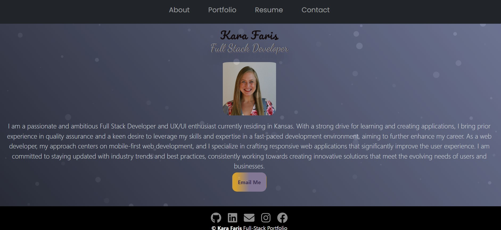

# React Portfolio

## Description 
The motivation behind this project was to create a dynamic and visually appealing React portfolio website that showcases my skills, projects, and experiences. The primary goal was to build a personal website that not only serves as an online resume but also as a platform to share my work and connect with potential employers or collaborators.

The project was built to solve several problems:

Online Presence: In today's digital age, having an online portfolio is essential for professionals in various fields. It provides a centralized location for potential employers or clients to learn more about the individual and their work.

Demonstration of Skills: Building a portfolio website in React allowed me to demonstrate my proficiency in modern web development technologies, including React.js, JSX, and CSS.

Effective Communication: The project aimed to effectively communicate my skills, experiences, and projects to visitors, making it easier for them to understand my background and the work I've done.

Portfolio Flexibility: By using React components, I could easily update and expand my portfolio in the future. Whether I want to add new projects, update my resume, or change the site's appearance, React's modular structure makes it highly adaptable.

Through this project, I learned how to:

Use React Components: I gained hands-on experience in creating reusable React components for the header, navigation, projects, and footer sections of the website.

Conditional Rendering: I learned how to conditionally render different sections of the portfolio using React's conditional rendering capabilities. For example, I could show or hide specific project details based on user interactions.

React Routing: To make the portfolio multi-page, I likely implemented React Router or a similar routing solution to handle navigation between different sections or pages within the website.

Styling with CSS: I practiced styling components and pages using CSS to ensure a visually appealing and cohesive design for the portfolio.

## Installation
Git clone the repository
Then in the terminal use "npm i" and then "npm run start"

## GitHub Repository
https://github.com/karafaris/reactportfolio.git

## Live Site URL
https://karafaris.github.io/reactportfolio/

## Screenshots

